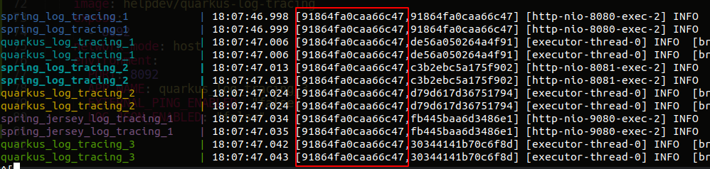

# Java log tracing

A idéia desse reposítório e realizar uma POC de comunicação entre dois frameworks utilizando o compartilhamento de traceId de uma requisição para impressão nos logs das aplicações. Foi utilizado o [Spring Boot com o Spring Cloud Sleuth](https://spring.io/projects/spring-cloud-sleuth) e o [Quarkus com o OpenTracing](quarkus.io/guides/opentracing).

# Executando a aplicação

- Faça o clone do projeto

- Execute o build

```
make build
```

- Gere as imagens docker

```
make install
```

- Inicie os clients

```
make run
```

# Testando

As aplicações serão iniciadas, com chamadas encadeadas entre elas, para demonstrar o compartilhamento do `traceId` e geração do `spanId` para cada request.
Ao chamar por exemplo o primeiro client: `http://localhost:8080/ping` a aplicação chamará as demais conforme o fluxo:

`spring_log_tracing_1 (8080) -> quarkus_log_tracing_1 (8090) -> spring_log_tracing_2 (8081) -> quarkus_log_tracing_2 (8091) -> spring_jersey_log_tracing_1 (9080) -> quarkus_log_tracing_3 (9092)`

Nota-se o objetivo do projeto ao monitorar os logs no qual foi configurado com o seguinte pattern:

`%d{HH:mm:ss.SSS} [%X{traceId},%X{spanId}] [%t] %-5p [%c{2.}] - %s%e%n`

Ex. de uma requisição na primeira app:

<p align="left">
    
</p>
